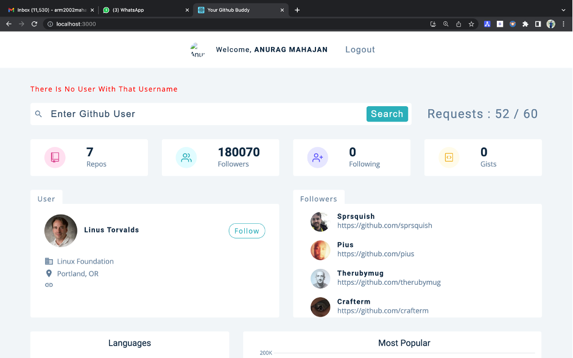

# GitInsight - Analyser of any GitHub Account's profile

>It is simple web application which gives insight of GitHub user's profile.

## Get the code at - https://github.com/ANURAG2002-CODER/GitInsight

<br>
<a href="https://github.com/ANURAG2002-CODER/GitInsight">GitInsight</a> is a React-based project that uses GitHub API to analyze a user's GitHub profile, providing insights into their coding habits and practices. It offers a user-friendly interface that allows users to input a GitHub username and retrieve data about the user's repositories, forks, commits, programming languages used, repository size, and activity level on GitHub. The tool is customizable and can be used by developers, managers, and recruiters to gain a deeper understanding of a user's skills and areas of expertise.

<br>

## Built With
| | |
|:-------------------------:|:-------------------------:|
|<a href="https://legacy.reactjs.org/" target="_blank">  </a>|<a href="https://nodejs.org/en" target="_blank">  </a>

## 💪🏻 Features
- Shows user description from his GitHub profile
- Shows users followers
- Shows languages used by user in his repositories as a pie chart
- Shows stars received by user for his top repositories as a histogram
- Shows stars per language as a doughnut
- Shows most forked repositories in bar chart form.
- Gives most contributor for all the repositories of a user 

<br>

## 🧑‍🔧 Working
- Home page

- Login page

- Dashboard page 

- Features


<br>

## 👨‍💻 Dependencies
 - Npm version 7.13.0

<br>

## 🏃‍♀️ Getting Started
### Running locally

- Clone the repository
```
git clone https://github.com/ANURAG2002-CODER/GitInsight
```
- Open terminal/ command prompt and change directory
```
cd "/GitInsight"  // path different for every user
```
- Install the dependencies
```
npm install
```
- Start the server
```
npm start
```
<br>

### Running this app using Docker

You'll need to have [Docker installed](https://docs.docker.com/get-docker/).
It's available on Windows, macOS and most distros of Linux. If you're new to
Docker and want to learn it in detail check out the [additional resources
links](#learn-more-about-docker-and-django) near the bottom of this README.

If you're using Windows, it will be expected that you're following along inside
of [WSL or WSL
2](https://nickjanetakis.com/blog/a-linux-dev-environment-on-windows-with-wsl-2-docker-desktop-and-more).
That's because we're going to be running shell commands. You can always modify
these commands for PowerShell if you want.

#### Clone this repo anywhere you want and move into the directory:

```sh
git clone https://github.com/ANURAG2002-CODER/GitInsight
cd GitInsight

# Optionally checkout a specific tag, such as: git checkout 0.4.0
```

#### Build everything:

*The first time you run this it's going to take 5-10 minutes depending on your
internet connection speed and computer's hardware specs. That's because it's
going to download a few Docker images and build the Python*

```sh
docker build --tag GitInsight:latest .
```

Now that everything is built. To get the app running use this command.


```sh
docker run --name GitInsight -d -p 8000:8000 GitInsight:latest
```

#### Setup the initial database:

```sh
./run manage migrate 
```

*We'll go over that `./run` script in a bit!*

#### Check it out in a browser:

Visit <http://localhost:8000> in your favorite browser.

<br>

## ⭐ Show your support

Give a ⭐ if this tool made your life easier!

Spread the word to your geek fellows to save their time!

<br>

## ✨ Contributors

<table>
	<tr align="center" style="font-weight:bold">
		<td>
		Anurag Mahajan
		<p align="center">
			
		</p>
			<p align="center">
				<a href = "https://github.com/ANURAG2002-CODER">
					
				</a>
			</p>
		</td>
	</tr>
</table>
